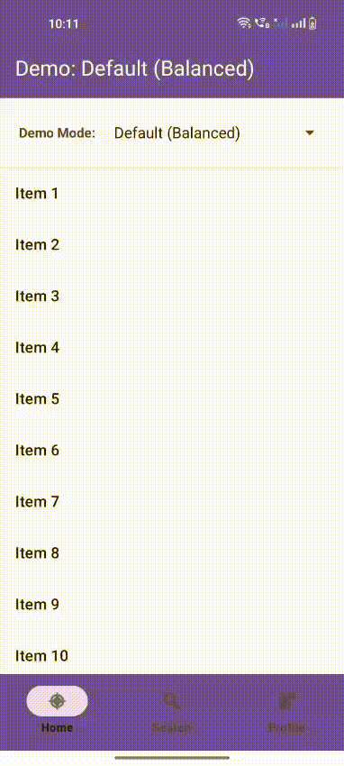

# Up Scroll Behavior Library

[](https://kotlinlang.org)
[](LICENSE)
[](#)
[](https://jitpack.io/#Excelsior-Technologies-Community/Android_UpScrollBehavior)

**Up Scroll Behavior** is a lightweight, highly customizable Android library that automatically hides and shows header and bottom views when scrolling a RecyclerView. Create immersive content experiences similar to Instagram, YouTube, and Twitter with just 2 lines of code.

---

## 📸 Preview



---

## ✨ Features

- **Auto-Hide/Show**: Automatically hides header and bottom views on scroll down, shows on scroll up
- **Highly Customizable**: 17+ XML attributes for complete control
- **Multiple Presets**: 10 built-in demo modes for common use cases
- **Smooth Animations**: Hardware-accelerated with 7 interpolator types
- **Scroll Sensitivity Control**: From aggressive (gallery) to conservative (reading)
- **Boundary Detection**: Auto-show at top/bottom of list
- **Works with Any View**: Not limited to AppBarLayout - use with Toolbar, BottomNavigation, FAB, etc.
- **Runtime Control**: Programmatic API for dynamic behavior changes
- **Performance Optimized**: 60fps smooth scrolling with minimal overhead
- **Easy Integration**: Just 2 lines of code for basic setup
- **Production-Ready**: Proper error handling, memory leak prevention

---

## 📦 Installation

### Step 1: Add JitPack repository to your root `build.gradle`:

```gradle
allprojects {
    repositories {
        maven { url 'https://jitpack.io' }
    }
}
```

### Step 2: Add dependency to your app module's `build.gradle`:

```gradle
dependencies {
       implementation 'com.github.Excelsior-Technologies-Community:Android_UpScrollBehavior:1.0.0'
}
```

---

## 🚀 Quick Start (2 Lines!)

```kotlin
val behavior = UpScrollBehavior(this)
behavior.setupWithRecyclerView(recyclerView, toolbar, bottomNav)
```

**That's it!** Your app now has Instagram-style auto-hiding UI.

---

## 💻 Usage Examples

### Basic Integration - XML

```xml
<androidx.constraintlayout.widget.ConstraintLayout>
    
    <!-- Header (Toolbar) -->
    <com.google.android.material.appbar.MaterialToolbar
        android:id="@+id/toolbar"
        android:layout_width="match_parent"
        android:layout_height="?attr/actionBarSize" />
    
    <!-- RecyclerView -->
    <androidx.recyclerview.widget.RecyclerView
        android:id="@+id/recyclerView"
        android:layout_width="match_parent"
        android:layout_height="0dp" />
    
    <!-- Bottom Navigation -->
    <com.google.android.material.bottomnavigation.BottomNavigationView
        android:id="@+id/bottomNav"
        android:layout_width="match_parent"
        android:layout_height="wrap_content" />
        
</androidx.constraintlayout.widget.ConstraintLayout>
```

### Basic Integration - Kotlin

```kotlin
class MainActivity : AppCompatActivity() {
    
    override fun onCreate(savedInstanceState: Bundle?) {
        super.onCreate(savedInstanceState)
        setContentView(R.layout.activity_main)
        
        val toolbar = findViewById<MaterialToolbar>(R.id.toolbar)
        val recyclerView = findViewById<RecyclerView>(R.id.recyclerView)
        val bottomNav = findViewById<BottomNavigationView>(R.id.bottomNav)
        
        // Setup RecyclerView
        recyclerView.layoutManager = LinearLayoutManager(this)
        recyclerView.adapter = MyAdapter()
        
        // Attach UpScrollBehavior
        val behavior = UpScrollBehavior(this)
        behavior.setupWithRecyclerView(recyclerView, toolbar, bottomNav)
    }
}
```

---

## 🎨 Demo Modes (Built-in Presets)

### 1️⃣ Social Media Feed (Instagram/Twitter)

**Use Case**: Maximum immersion for content-focused feeds

```kotlin
// Kotlin
val behavior = UpScrollBehavior(this)
behavior.setupWithRecyclerView(recyclerView, toolbar, bottomNav)
```

```xml
<!-- XML Configuration -->
<androidx.recyclerview.widget.RecyclerView
    app:upScroll_scrollThreshold="15"
    app:upScroll_animationDuration="250"
    app:upScroll_interpolatorType="decelerate"
    app:upScroll_autoShowAtTop="true" />
```

**Characteristics**:
- ⚡ Fast response (15px threshold)
- 🎬 Quick animation (250ms)
- 🔄 Works during fling
- 📱 Both header and bottom hide

---

### 2️⃣ Reading App (Conservative)

**Use Case**: Long articles, prevent accidental navigation loss

```kotlin
// Only hide header, keep bottom nav visible
behavior.setupWithRecyclerView(
    recyclerView = recyclerView,
    headerView = toolbar,
    bottomView = null  // Bottom stays visible
)
```

```xml
<!-- XML Configuration -->
<androidx.recyclerview.widget.RecyclerView
    app:upScroll_enableHeaderHide="true"
    app:upScroll_enableBottomHide="false"
    app:upScroll_scrollThreshold="60"
    app:upScroll_minScrollDistance="10"
    app:upScroll_respectFling="false" />
```

**Characteristics**:
- 🐌 Slower response (60px)
- 📍 Bottom always visible
- 🚫 Ignores fling gestures

---

### 3️⃣ Photo/Video Gallery (Aggressive)

**Use Case**: Media galleries requiring instant immersion

```xml
<androidx.recyclerview.widget.RecyclerView
    app:upScroll_scrollThreshold="8"
    app:upScroll_minScrollDistance="2"
    app:upScroll_animationDuration="150"
    app:upScroll_interpolatorType="accelerateDecelerate" />
```

**Characteristics**:
- ⚡⚡ Ultra-fast (8px threshold)
- 🏃 Very quick animation (150ms)
- 📸 Content-first experience

---

### 4️⃣ E-Commerce (Fixed Header)

**Use Case**: Keep search/filters accessible, hide cart

```kotlin
behavior.setupWithRecyclerView(
    recyclerView = recyclerView,
    headerView = null,  // Header stays fixed
    bottomView = bottomCartView
)
```

**Characteristics**:
- 🔍 Search always accessible
- 🛒 Cart hides when browsing
- 📦 Auto-show at bottom

---

### 5️⃣ Settings List (No Auto-Hide)

**Use Case**: Forms, settings, where navigation must stay visible

```kotlin
behavior.setupWithRecyclerView(recyclerView, toolbar, bottomNav)
behavior.setEnabled(false)  // Disable behavior
```

```xml
<androidx.recyclerview.widget.RecyclerView
    app:upScroll_enabled="false" />
```

---

## ⚙️ XML Attributes (Complete List)

### Enable/Disable Controls

| Attribute | Type | Default | Description |
|-----------|------|---------|-------------|
| `upScroll_enabled` | boolean | true | Enable/disable entire behavior |
| `upScroll_enableHeaderHide` | boolean | true | Enable header hide on scroll |
| `upScroll_enableBottomHide` | boolean | true | Enable bottom hide on scroll |
| `upScroll_enableAnimation` | boolean | true | Enable smooth animations |

### Animation Configuration

| Attribute | Type | Default | Description |
|-----------|------|---------|-------------|
| `upScroll_animationDuration` | integer | 300 | Animation duration in milliseconds |
| `upScroll_interpolatorType` | enum | decelerate | Animation curve (see below) |
| `upScroll_snapAnimation` | boolean | true | Use animation vs instant snap |

### Scroll Sensitivity

| Attribute | Type | Default | Description |
|-----------|------|---------|-------------|
| `upScroll_scrollThreshold` | integer | 20 | Pixels to scroll before triggering |
| `upScroll_minScrollDistance` | integer | 5 | Minimum scroll to detect (noise filter) |

### Behavior Control

| Attribute | Type | Default | Description |
|-----------|------|---------|-------------|
| `upScroll_hideOnScrollDown` | boolean | true | Hide views when scrolling down |
| `upScroll_showOnScrollUp` | boolean | true | Show views when scrolling up |
| `upScroll_autoShowAtTop` | boolean | true | Auto-show when reaching top |
| `upScroll_autoShowAtBottom` | boolean | false | Auto-show when reaching bottom |

### Advanced Options

| Attribute | Type | Default | Description |
|-----------|------|---------|-------------|
| `upScroll_respectFling` | boolean | true | Respond to fling gestures |
| `upScroll_hideImmediately` | boolean | false | Hide without animation |
| `upScroll_showImmediately` | boolean | false | Show without animation |
| `upScroll_headerHeightOverride` | dimension | - | Custom header height |
| `upScroll_bottomHeightOverride` | dimension | - | Custom bottom height |

---

## 🎭 Interpolator Types

Control animation feel with different interpolators:

```xml
app:upScroll_interpolatorType="[value]"
```

| Value | Effect | Best For |
|-------|--------|----------|
| `linear` | Constant speed | Utility apps |
| `accelerate` | Starts slow, ends fast | Dramatic exits |
| `decelerate` | Starts fast, ends slow | **Recommended - Most natural** |
| `accelerateDecelerate` | Smooth S-curve | Professional feel |
| `anticipate` | Pulls back first | Unique effect |
| `overshoot` | Bounces past target | Playful apps |
| `bounce` | Multiple bounces | Fun/games |

---

## 💻 Programmatic API

### Basic Control Methods

```kotlin
val behavior = UpScrollBehavior(context)

// Setup
behavior.setupWithRecyclerView(recyclerView, headerView, bottomView)

// Manual control
behavior.hideHeader()
behavior.showHeader()
behavior.hideBottom()
behavior.showBottom()

// With instant option (no animation)
behavior.hideHeader(immediate = true)
behavior.showBottom(immediate = false)

// State management
behavior.setEnabled(false)
behavior.resetState()

// Check state
val isHeaderVisible = behavior.isHeaderVisible()
val isBottomVisible = behavior.isBottomVisible()
val isEnabled = behavior.isEnabled()

// Cleanup
behavior.detach()
```

### Advanced Examples

#### Dynamic Configuration

```kotlin
// Switch between different behaviors at runtime
when (userPreference) {
    "immersive" -> {
        behavior.setupWithRecyclerView(recyclerView, toolbar, bottomNav)
    }
    "conservative" -> {
        behavior.setupWithRecyclerView(recyclerView, toolbar, null)
    }
    "disabled" -> {
        behavior.setEnabled(false)
    }
}
```

#### Fragment Integration

```kotlin
class MyFragment : Fragment() {
    private var behavior: UpScrollBehavior? = null
    
    override fun onViewCreated(view: View, savedInstanceState: Bundle?) {
        super.onViewCreated(view, savedInstanceState)
        
        behavior = UpScrollBehavior(requireContext())
        behavior?.setupWithRecyclerView(recyclerView, toolbar, bottomNav)
    }
    
    override fun onDestroyView() {
        behavior?.detach()
        behavior = null
        super.onDestroyView()
    }
}
```

#### Button Toggle Example

```kotlin
toggleButton.setOnClickListener {
    if (behavior.isHeaderVisible()) {
        behavior.hideHeader()
        behavior.hideBottom()
    } else {
        behavior.showHeader()
        behavior.showBottom()
    }
}
```

---

## 🎯 Configuration Recipes

### High Sensitivity (Gallery/Video)

```xml
<androidx.recyclerview.widget.RecyclerView
    app:upScroll_scrollThreshold="10"
    app:upScroll_minScrollDistance="2"
    app:upScroll_animationDuration="150"
    app:upScroll_respectFling="true" />
```

### Low Sensitivity (Reading/Forms)

```xml
<androidx.recyclerview.widget.RecyclerView
    app:upScroll_scrollThreshold="80"
    app:upScroll_minScrollDistance="10"
    app:upScroll_animationDuration="400"
    app:upScroll_respectFling="false" />
```

### No Animation (Performance)

```xml
<androidx.recyclerview.widget.RecyclerView
    app:upScroll_enableAnimation="false"
    app:upScroll_snapAnimation="false" />
```

### Playful (Bouncy)

```xml
<androidx.recyclerview.widget.RecyclerView
    app:upScroll_animationDuration="500"
    app:upScroll_interpolatorType="overshoot" />
```

---

### Key Concepts

1. **Scroll Detection**: Monitors RecyclerView scroll events
2. **Accumulation**: Collects scroll distance until threshold reached
3. **Decision**: Determines hide/show based on direction and config
4. **Animation**: Smoothly translates views using hardware-accelerated TranslationY
5. **Boundary Handling**: Auto-shows at top/bottom if configured

### Why TranslationY?

- ✅ Hardware accelerated (GPU)
- ✅ No layout recalculations
- ✅ 60fps smooth animations
- ✅ Doesn't affect other views
- ✅ Reversible without state management

---

## 🔧 Troubleshooting

### Views not hiding?

1. **Check if enabled**: `behavior.isEnabled()`
2. **Lower threshold**: Try `app:upScroll_scrollThreshold="10"`
3. **Verify views**: Ensure `headerView` and `bottomView` are not null
4. **Check content**: RecyclerView must have scrollable content

### Jerky animations?

1. **Reduce duration**: Use `200ms` instead of `500ms`
2. **Change interpolator**: Try `decelerate` or `accelerateDecelerate`
3. **Increase min scroll**: Filters out noise with `minScrollDistance="10"`

### Views hidden at start?

```kotlin
behavior.setupWithRecyclerView(...)
behavior.showHeader(immediate = true)
behavior.showBottom(immediate = true)
```

### Memory leaks?

```kotlin
override fun onDestroy() {
    behavior.detach()  // Always cleanup!
    super.onDestroy()
}
```

---

## 📱 Device Recommendations

### Small Phones (< 6")
```xml
app:upScroll_scrollThreshold="15"
app:upScroll_animationDuration="250"
```
Screen space is critical.

### Large Phones/Tablets (> 6")
```xml
app:upScroll_scrollThreshold="30"
app:upScroll_animationDuration="300"
```
More screen space available.

### Low-End Devices
```xml
app:upScroll_enableAnimation="false"
app:upScroll_scrollThreshold="30"
```
Performance optimization.

---

## ♿ Accessibility

### Reduced Motion Support

```kotlin
val isReduceMotionEnabled = // Check system setting
if (isReduceMotionEnabled) {
    // Disable animations
    behavior.setupWithRecyclerView(...)
    // Configure for accessibility
}
```

```xml
<androidx.recyclerview.widget.RecyclerView
    app:upScroll_enableAnimation="false"
    app:upScroll_snapAnimation="false" />
```

### High Stability Mode

```xml
<androidx.recyclerview.widget.RecyclerView
    app:upScroll_scrollThreshold="100"
    app:upScroll_minScrollDistance="20"
    app:upScroll_respectFling="false" />
```

Perfect for users with motor impairments or elderly users.

---

## 📊 Performance

- **Frame Rate**: Consistent 60fps
- **Method**: Hardware-accelerated TranslationY
- **Overhead**: Minimal - no layout recalculations
- **Memory**: Proper cleanup prevents leaks
- **Battery**: Efficient - GPU accelerated animations

---

## 📄 License

```
MIT License

Copyright (c) 2025 Excelsior Technologies

Permission is hereby granted, free of charge, to any person obtaining a copy
of this software and associated documentation files (the "Software"), to deal
in the Software without restriction, including without limitation the rights
to use, copy, modify, merge, publish, distribute, sublicense, and/or sell
copies of the Software, and to permit persons to whom the Software is
furnished to do so, subject to the following conditions:

The above copyright notice and this permission notice shall be included in all
copies or substantial portions of the Software.

THE SOFTWARE IS PROVIDED "AS IS", WITHOUT WARRANTY OF ANY KIND, EXPRESS OR
IMPLIED, INCLUDING BUT NOT LIMITED TO THE WARRANTIES OF MERCHANTABILITY,
FITNESS FOR A PARTICULAR PURPOSE AND NONINFRINGEMENT. IN NO EVENT SHALL THE
AUTHORS OR COPYRIGHT HOLDERS BE LIABLE FOR ANY CLAIM, DAMAGES OR OTHER
LIABILITY, WHETHER IN AN ACTION OF CONTRACT, TORT OR OTHERWISE, ARISING FROM,
OUT OF OR IN CONNECTION WITH THE SOFTWARE OR THE USE OR OTHER DEALINGS IN THE
SOFTWARE.
```

---
